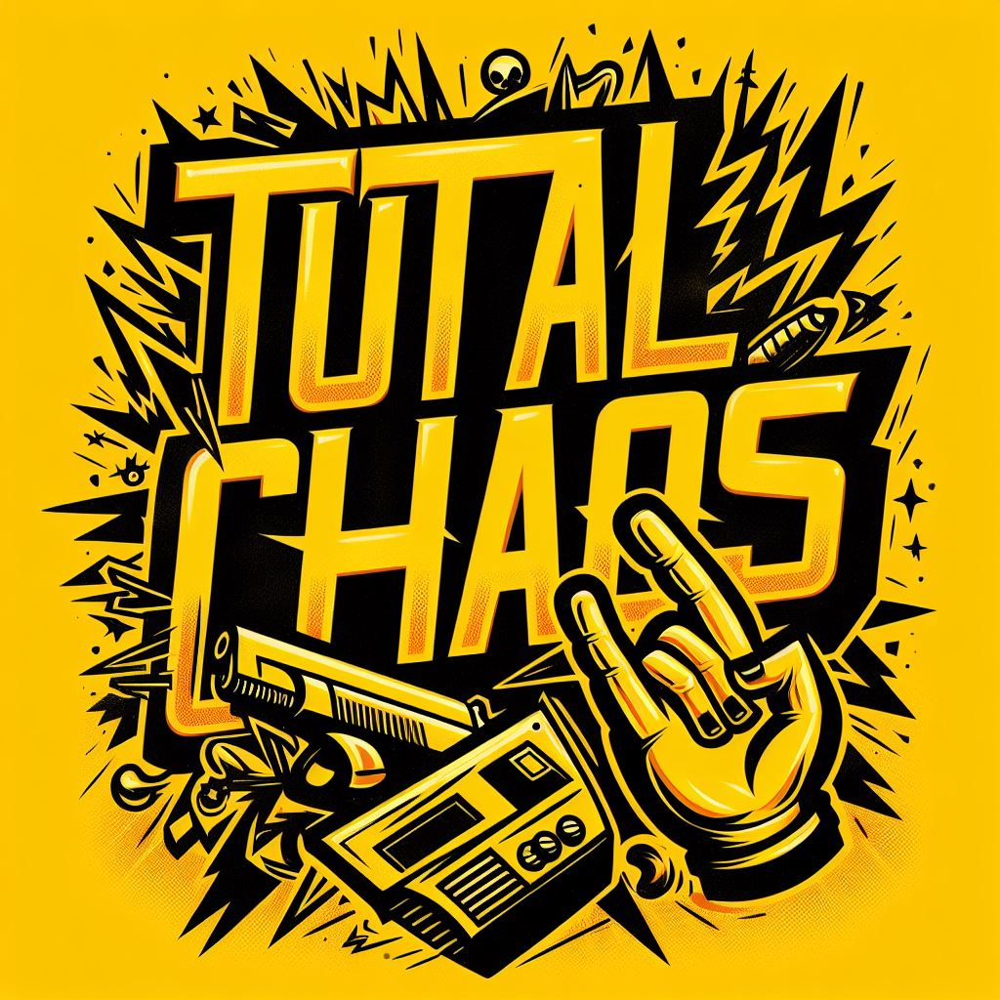

# TotalChaos
## A Racing game made in Unity

#### Currently made for networks course will be polished for market later on.

The Game takes inspiration from games like Twisted Metal and Mario Kart and it focuses on being as arcade and as chaotic as possible while being a racing game utilizing physics mechanics for cars and providing an excellent multiplayer experience

## About

The Game allows you to play with various types of cars, each has a unique structure and theme to it making the game feel as arcady as possible

### Cars

All Cars have available powerups for them to get advantages to win

#### Current Powerups
 

### Team Members
1) Mohamed Taymour 20100152
2) Yahya ElAdawy 20102610
3) Ahmed Abo AlRoos 20108086
4) Yahya Zakareya 20100186
